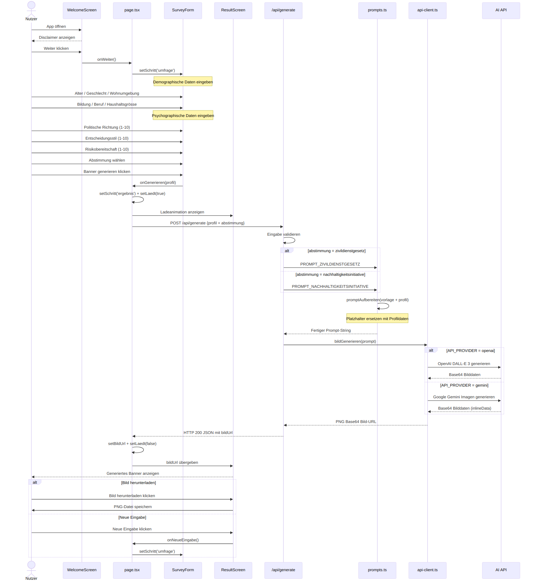
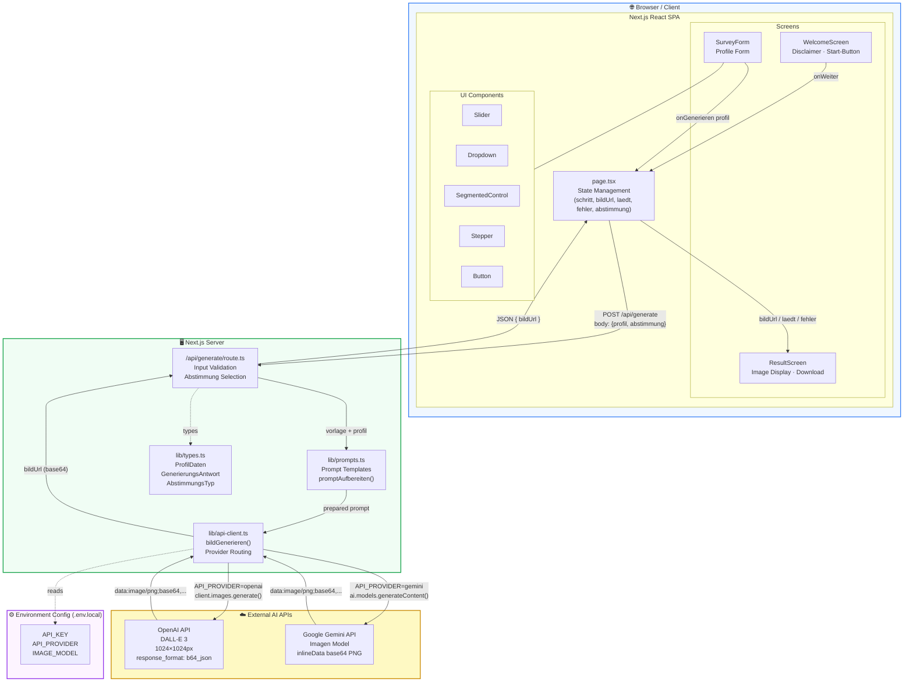
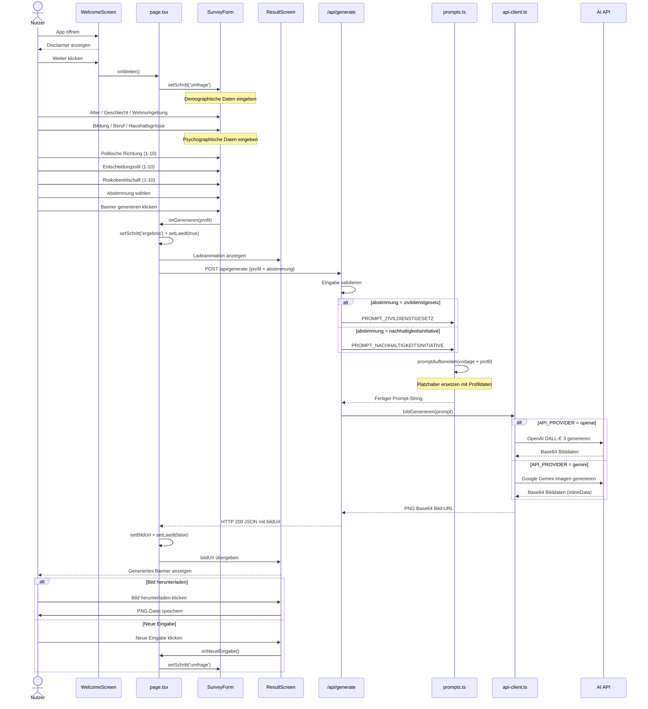

# IT-Architektur & IT-Flow Diagramme

> Artefakt der Bachelor-Thesis «KI-politische Werbebanner» – Berner Fachhochschule (BFH)  
> Diese Diagramme dokumentieren die technische Architektur und den Datenfluss der Applikation, ohne den Quellcode zu verändern.

---

## 1. IT-Architektur

Das folgende Diagramm zeigt die Komponentenstruktur der Applikation mit allen Schichten (Client, Server, externe APIs) und deren Abhängigkeiten.

### Schichtbeschreibung

| Schicht | Technologie | Beschreibung |
|---|---|---|
| **Browser / Client** | Next.js 16 · React 19 · Framer Motion · Tailwind CSS 4 | Single-Page-App mit drei Screens und wiederverwendbaren UI-Komponenten |
| **Next.js Server** | Next.js App Router · API Routes | Serverseitige Validierung, Prompt-Aufbereitung und API-Abstraktion |
| **Externe KI-APIs** | OpenAI DALL-E 3 / Google Gemini Imagen | Bildgenerierung auf Basis des aufbereiteten Prompts |
| **Konfiguration** | `.env.local` | `API_KEY`, `API_PROVIDER`, `IMAGE_MODEL` |

### Wichtige Dateien

| Datei | Zweck |
|---|---|
| `app/page.tsx` | Haupt-App · State Management · Screen-Navigation |
| `app/api/generate/route.ts` | POST-Handler · Validierung · Prompt-Auswahl |
| `lib/prompts.ts` | Prompt-Vorlagen für beide Volksabstimmungen |
| `lib/api-client.ts` | Abstraktion für OpenAI und Google Gemini |
| `lib/types.ts` | TypeScript-Interfaces (`ProfilDaten`, `AbstimmungsTyp`) |
| `components/WelcomeScreen.tsx` | Screen 1 – Disclaimer & Start |
| `components/SurveyForm.tsx` | Screen 2 – Profilerfassung |
| `components/ResultScreen.tsx` | Screen 3 – Bildanzeige & Download |

---

## 2. IT-Flow (Datenfluss / Sequenzdiagramm)

Das folgende Diagramm zeigt den vollständigen Ablauf von der Nutzereingabe bis zur Anzeige des generierten Banners.

### Ablaufbeschreibung

1. **Willkommensscreen** – Nutzer öffnet die App, liest den Disclaimer, klickt «Weiter»
2. **Profilerfassung** – Nutzer gibt demographische und psychographische Daten ein und wählt die Abstimmung
3. **API-Aufruf** – Frontend sendet `POST /api/generate` mit `{profil, abstimmung}`
4. **Prompt-Aufbereitung** – Server wählt die passende Vorlage und ersetzt alle Platzhalter mit den Profildaten
5. **Bildgenerierung** – `api-client.ts` leitet den Prompt an OpenAI DALL-E 3 oder Google Gemini weiter
6. **Ergebnisanzeige** – Das generierte Bild (Base64 PNG) wird im `ResultScreen` angezeigt und kann heruntergeladen werden

---

## 3. Mermaid-Quellcode

Die Diagramme wurden mit [Mermaid](https://mermaid.js.org/) erstellt. Die Quell-Dateien liegen im gleichen Verzeichnis:

- [`it-architecture.mmd`](./it-architecture.mmd) – IT-Architektur (Graph)
- [`it-flow.mmd`](./it-flow.mmd) – IT-Flow (Sequenzdiagramm)

### IT-Architektur (Mermaid-Code)

### IT-Flow (Mermaid-Code)

