# IT-Flow der Applikation

> Visualisierung des technischen Ablaufs für die Bachelorarbeit

```mermaid
flowchart TD
    classDef user        fill:#4F86C6,stroke:#2c5f8a,color:#fff,rx:20,ry:20
    classDef form        fill:#F5A623,stroke:#c47d0e,color:#fff
    classDef process     fill:#5BA85A,stroke:#3a7039,color:#fff
    classDef decision    fill:#E87C3E,stroke:#b55520,color:#fff
    classDef database    fill:#8B5CF6,stroke:#5b35c5,color:#fff

    U1([👤 Benutzer öffnet die App]):::user
    F1[/Startseite: Willkommen & Einführung/]:::form

    U2([👤 Benutzer füllt Demografieformular aus]):::user
    F2[/Demografische Angaben\nAlter · Geschlecht · Wohnkanton/]:::form
    P1[Daten validieren & aufbereiten]:::process
    API1[API-Route: POST /api/participants]:::process
    DB1[(Supabase PostgreSQL\n─────────────\nTabelle: Participants)]:::database

    U3([👤 Benutzer beantwortet Umfrage-Frage]):::user
    P2[Nächste Frage & Banner laden]:::process
    API2[API-Route: GET /api/banners]:::process
    DB2[(Supabase PostgreSQL\n─────────────\nTabelle: Banners)]:::database
    F3[/Banner & Frage werden angezeigt/]:::form
    D1{Weitere\nFragen?}:::decision

    U4([👤 Benutzer sieht Danke-Seite]):::user
    P3[Alle Antworten übermitteln]:::process
    API3[API-Route: POST /api/responses]:::process
    DB3[(Supabase PostgreSQL\n─────────────\nTabelle: Responses)]:::database
    END([✅ Umfrage abgeschlossen]):::user

    %% Flow
    U1  --> F1
    F1  --> U2
    U2  --> F2
    F2  --> P1
    P1  --> API1
    API1 --> DB1

    DB1 --> U3
    U3  --> P2
    P2  --> API2
    API2 --> DB2
    DB2 --> F3
    F3  --> D1

    D1  -- Ja  --> U3
    D1  -- Nein --> U4
    U4  --> P3
    P3  --> API3
    API3 --> DB3
    DB3 --> END
```

## Legende

| Symbol | Bedeutung |
|---|---|
| 🔵 Abgerundetes Rechteck | Benutzeraktion |
| 🟠 Parallelogramm | Ein-/Ausgabe (Formular, Anzeige) |
| 🟢 Rechteck | Prozess (Frontend / Backend) |
| 🟡 Raute | Entscheidung |
| 🟣 Zylinder | Datenbank (Supabase PostgreSQL) |

## Beschreibung

1. **Startseite** – Der Benutzer wird begrüsst und erhält eine Einführung in die Studie.
2. **Demografieerfassung** – Der Benutzer gibt demografische Angaben ein. Diese werden via `POST /api/participants` in der Tabelle **Participants** gespeichert.
3. **Umfrage** – Für jede Frage wird ein KI-generiertes Banner via `GET /api/banners` geladen (Tabelle **Banners**). Dieser Schritt wiederholt sich, bis alle Fragen beantwortet sind.
4. **Danke-Seite** – Alle Antworten werden via `POST /api/responses` in der Tabelle **Responses** gespeichert. Die Umfrage ist abgeschlossen.
