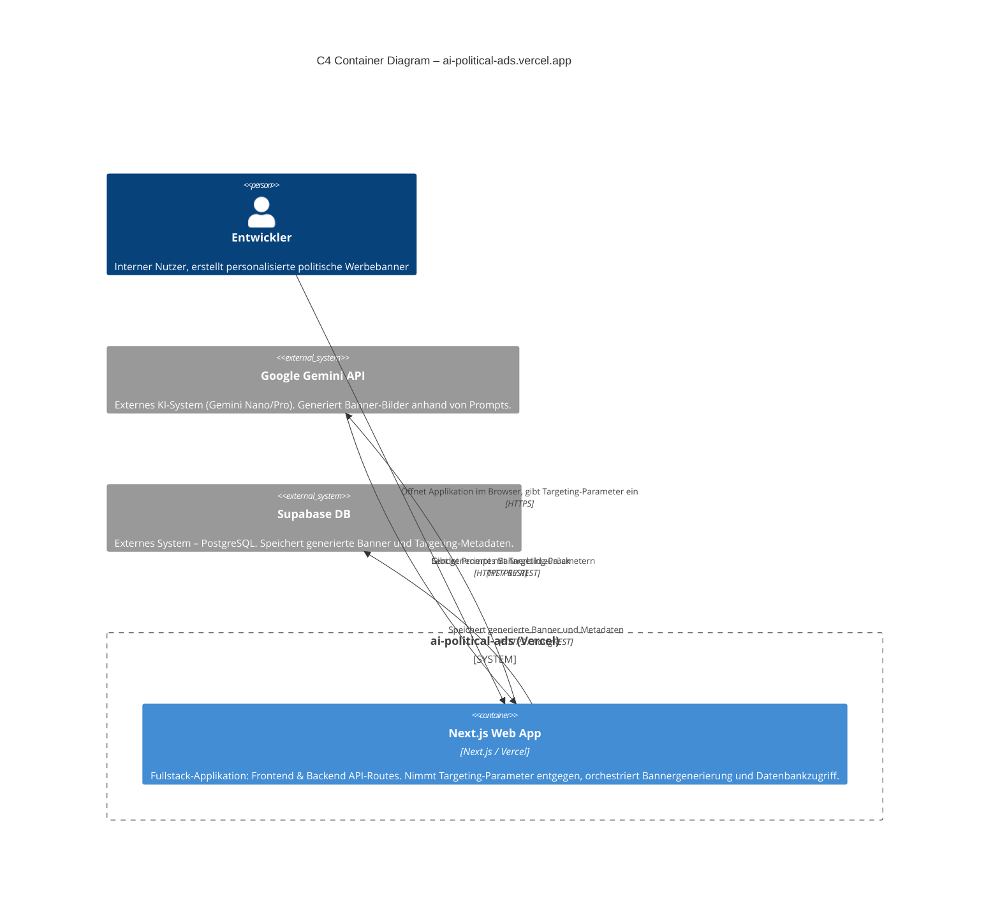

## Mermaid C4 Container Diagram

```mermaid
C4Container
    title C4 Container Diagram – ai-political-ads.vercel.app

    Person(dev, "Entwickler", "Interner Nutzer, erstellt personalisierte politische Werbebanner")

    System_Boundary(internal, "ai-political-ads (Vercel)") {
        Container(webapp, "Next.js Web App", "Next.js / Vercel", "Fullstack-Applikation: Frontend & Backend API-Routes. Nimmt Targeting-Parameter entgegen, orchestriert Bannergenerierung und Datenbankzugriff.")
    }

    System_Ext(gemini, "Google Gemini API", "Externes KI-System (Gemini Nano/Pro). Generiert Banner-Bilder anhand von Prompts.")
    System_Ext(supabase, "Supabase DB", "Externes System – PostgreSQL. Speichert generierte Banner und Targeting-Metadaten.")

    Rel(dev, webapp, "Öffnet Applikation im Browser, gibt Targeting-Parameter ein", "HTTPS")
    Rel(webapp, gemini, "Sendet Prompt mit Targeting-Parametern", "HTTPS / REST")
    Rel(gemini, webapp, "Gibt generiertes Bannerbild zurück", "HTTPS / REST")
    Rel(webapp, supabase, "Speichert generierte Banner und Metadaten", "HTTPS / PostgREST")
```
